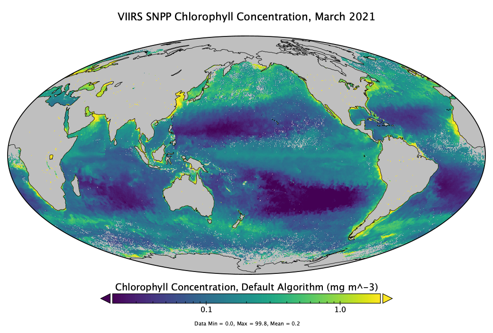

# NetCDF and Panoply Tutorial  

NOAA CoastWatch, Jan 2022

In this tutorial you will use Panoply software to open and view netCDF data. This tutorial uses Panoply v5.0.0, released Jan 2022. If you have an older version of Panoply, see our previous tutorial [NetCDF and Panoply v4.x](https://www.unidata.ucar.edu/software/netcdf/docs/netcdf_introduction.html)
<br>

## Table of Contents

[NetCDF](#netcdf)  
[Panoply](#nasa-panoply)  
[Tutorial 1: Global Chlorophyll](#example-1)  
[Tutorial 2: Global SST](#example-2)  
[Tutorial 3: Zooming to a Region](#example-3)  
[Tutorial 4: Files with multiple time steps](#example-4)  
[Tutorial 5: Vector Plots](#example-5)  
[References](#references)  

## NetCDF <a id="netcdf"></a>

NetCDF (Network Common Data Form) is a file format for storing multidimensional scientific data (variables), including satellite observations such as sea surface temperature, salinity, chlorophyll concentration, and wind speed. 

Many organizations and scientific groups in different countries have adopted netCDF as a standard way to represent scientific data.

The NetCDF format has many advantages, the most important of which is that it is self-describing, meaning that software packages can directly read the data and determine its structure, the variable names and essential metadata such as the units. 
This means that the information needed to ensure accurate work (reduce the incidence of errors) is available within the data itself (no need for additional files). Secondly, it means that different analysis software, like Matlab, R, Python or ArcGIS (among many others), have utilities to read and work with NetCDF files. Thirdly, plotting software (e.g. Ferret, Panoply, ncview) can directly read the netCDF files for visualization.  
<br>


<br>


<br>

---

<br>

## NASA Panoply <a id="nasa-panoply"></a>

NASA developed Panoply for viewing and visualizing data from NetCDF files. 

* Visualize data from netCDF and HDF files
* View metadata and data
* Display data in many map projections
* Download visualization as images
* Create animations

<!--[Panoply visualization, data, and Metadata interfaces ](../../../satellite-course-may2021/blob/master/.gitbook/assets/panoply_3.png)-->

Panoply is available for download at: **[https://www.giss.nasa.gov/tools/panoply/](https://www.giss.nasa.gov/tools/panoply/)** and can be run on Windows, Mac and Linux computers. 

<!--A set of "how to" instructions can be found to the following URL   
[https://www.giss.nasa.gov/tools/panoply/help/](https://www.giss.nasa.gov/tools/panoply/help/)  
Below are a few examples to try out to get you used to visualizing data with the Panoply Viewer.-->

---

<br>

## Tutorial 1. Make a map of global chlorophyll a concentration <a id="example-1"></a>

In this example you will download a netCDF file and open it in Panoply. You will learn how to view information about the dataset in the file metadata and create a plot of the data.

**1. Download a netCDF file**  

  * Download data from the NOAA VIIRS, Science Quality Chlorophyll dataset by clicking on the link below. 
  * The link will open in your default browser and begin the download for the March 2021 monthly chlorophyll product. 

    [https://coastwatch.pfeg.noaa.gov/erddap/griddap/nesdisVHNSQchlaMonthly.nc?chlor_a[(2021-03-01T12:00:00Z)][(0.0)][(89.75625):(-89.75626)][(-179.9812):(179.9813)]&.draw=surface&.vars=longitude|latitude|chlor_a](https://coastwatch.pfeg.noaa.gov/erddap/griddap/nesdisVHNSQchlaMonthly.nc?chlor_a[%282021-03-01T12:00:00Z%29][%280.0%29][%2889.75625%29:%28-89.75626%29][%28-179.9812%29:%28179.9813%29]&.draw=surface&.vars=longitude|latitude|chlor_a)

**2. Launch Panoply**  

  * On Mac and Linux, it is best to launch Panoply from your command prompt. On Windows launch it with the panoply.exe file. See the installed readme file for details.  
  
  * When Panoply opens, it prompts you to open a file. Open the file you just downloaded.  

    

<br>

**3. View Dataset Metadata**  

   Once a dataset is loaded, you can view the metadata details on the right pane. With the dataset name highlighted on the left, scroll down on the right pane to view more metadata details. These are global attributes for the dataset. Here you will find helpful information about the dataset, such as:  
  
  * **platform**  |  This is data from the Suomi-NPP satellite

  
  * **instrument**  | VIIRS 

  * **processing version**  |  2018.0

  
  * **time coverage**  |  2002 to 2018

  * **summary**  |  A brief description of the dataset

    ```
    summary = Level-3 Standard Mapped Image (SMI), Global, 4km, Chlorophyll, Monthly composite data from the Visible and Infrared Imager/Radiometer Suite (VIIRS). These are science quality data with a 15-day latency. The data, processed by the NOAA/STAR Ocean Color Team, are produced from MSL12 v1.2 using OC-SDR v04 and were release by CoastWatch as of 2017-08-07. VIIRS is a multi-disciplinary instrument that flies on the Suomi-NPP (National Polar-orbiting Partnership) satellite and is the successor to MODIS. Suomi-NPP is the initial spacecraft in the JPSS (Joint Polar Satellite Systems) series of spacecraft. JPSS is our Nation's next generation polar-orbiting operational environmental satellite system. JPSS is a collaborative program between NOAA and its acquisition agent NASA.
    ```

  * **License**  |  How the data may be used and how the acknowledge the data provider.

    ```
    license = [https://science.nasa.gov/earth-science/earth-science-data/data-information-policy/](https://science.nasa.gov/earth-science/earth-science-data/data-information-policy/\nThe) The data may be used and redistributed for free but is not intended for legal use, since it may contain inaccuracies. Neither the data\nContributor, ERD, NOAA, nor the United States Government, nor any of their employees or contractors, makes any warranty, express or implied, including warranties of merchantability and fitness for a particular purpose, or assumes any legal liability for the accuracy, completeness, or usefulness, of this information. Please acknowledge the use of these data with the following statement: "These data were provided by NOAA\'s Center for Satellite Applications & Research (STAR) and the CoastWatch program and distributed by NOAA/NMFS/SWFSC/ERD.\" To reference these data as a citation in a paper, please follow the instructions in the license and at this link: [https://coastwatch.pfeg.noaa.gov/erddap/information.html\#citeDataset](https://coastwatch.pfeg.noaa.gov/erddap/information.html#citeDataset)"
    ```

  * **Digital Object Identifier (DOI)**

    The metadata may also contain a Digital Object Identifier (DOI), which is a persistent identifier used to identify objects uniquely. It typically links to a webpage with extra information about the data. This dataset file doesn't have a DOI in the metadata. Metadata varies from file to file depending on how much information is provided by the person/institution who generated the file.

<br>

**4. Create a Custom Plot of the Chlorophyll Data**  

* **First, Create a default plot**  

  * On the left side of the screen, double click on the `chlor_a` variable. 
  * Keep the default settings and click **Create** 
  * This will take a minute, it’s a big file  
  <br>
    

<br>

* **View the Data Values**  

  * Above the image there are tabs, click on the **Array 1** tab. 
  
  * This shows you the values of chlorophyll concentration for each longitude/latitude pixel.  
  


* **Adjust the scale**  

  * Click back to the the **Plot** tab.   
  
  * From the Panoply menu bar, click on **Window** and select **Scale**. 
  
  * A window will open with settings for the color scale. You can drag this to the side of your plot.
  
  * You may notice a lag between adjusting values and seeing the results. It’s a big file.
  
  * Change **Units** from `scalar` to `log10`
  
  * Set the **color scale** to `0.02` to `2.0`
  
  * Set the **Color Table** to a different palette. Try the `MPL_viridis.rgb` for chlorophyll concentration, but choose whichever one you prefer.
  
    >You can download additional color palettes from:   [https://www.giss.nasa.gov/tools/panoply/colorbars/](https://www.giss.nasa.gov/tools/panoply/colorbars/) 

* **Adjust the Map Projection**  

  * From the Panoply menu bar, click on **Window** and select **Map Projection**  
  
  * A window will open with settings for the map projection. You can drag this to the side of your plot.  
  
  * Set the **Projection** to `Mollweide Oblique`  
  
  * Change **Center on: Lon.** value to `180º` to center the map on the Pacific.  
  
  * Change **Grid: style** to `none` if you want to remove the longitude/latitude grid.  
  
  
* **Adjust the Plot Labels**  

  * Remove the Data Min and max labels under the plot  
  
  * Uncheck the **data min-max** box in `Window > Labels > Footnotes: center`  
  
  * Edit the Title to “VIIRS SNPP Chlorophyll Concentration, March 2021”  
  
  
* **Save the Plot**  

  * Save the image to your computer (File &gt; Save image).

  

<br>

---

<br>

## Tutorial 2. Make a Map of Global SST <a id="example-2"></a>

Download a global Sea Surface Temperature dataset from CoastWatch and create a map. This is a blended satellite data product which means it has data from multiple satellites. 

1. In a browser, go to the HTTPS server for the dataset and download any file: 

    [https://coastwatch.noaa.gov/pub/socd2/coastwatch/sst_blended/sst5km/night/ghrsst/2022/](https://coastwatch.noaa.gov/pub/socd2/coastwatch/sst_blended/sst5km/night/ghrsst/2022/)

2. Open the file in Panoply and view the metadata. Scroll down the metadata list. You can see it looks different from the metadata in the previous example.

3. Identify the names of the instruments and satellites the data come from 

4. How many satellites were used to create this gap-free SST dataset?  

5. Following the same steps as the previous example, create an image of the 
**analysed_sst** variable with an appropriate color scale. (You do not need to use a log scale for SST).

    * Change the **Units** to ºC or ºF  
    
    * Click on **Fit to Data** or adjust the range values manually  
    
    * Adjust the Label Title with the file’s date  
    
    * Uncheck the **Show data min-max** box under `Window > Labels > Footnotes: center`  
    
    * Save the image to your computer  
    

    
<br>

---

<br>

## Tutorial 3. Zooming to a Region <a id="example-3"></a>

1. Close any windows showing maps.

2. From the Datasets list, double-click on **analysed_sst** again and click **Create**.

3. Zooming
    * To zoom in on a region, push the **Ctrl** key with Windows or the **command** key on Mac. Your cursor will change to a magnifying glass. 
  
    * Hold the **Ctrl** or **command** key down, and click and drag over a region of interest. 
  
    * This generates a plot for that region only.
  
4. Adjust Map Proportions  

    * From the Panoply menu bar, click on **Window** and select **Map Projection**
    
    * Click **Fix Proportions**

5. Following the same steps as the previous examples

    * Change the **Units** to ºC or ºF.
    
    * Click on **Fit to Data** or adjust the range values manually.
    
    * Adjust the Label Title with the file’s date.
    
    * Save to your computer.


<br><br>

---

<br>

## Tutorial 4. Files with multiple time steps <a id="example-4"></a>

Download and view four months of wind speed data from the ASCAT instrument on the MetOps satellite for the Alaska region from September to December, 2020.

1. Download wind netCDF data using the following URL  
[https://coastwatch.pfeg.noaa.gov/erddap/griddap/erdQBdivmodmday.nc?mod[(2020-09-16T00:00:00Z):1:(2020-12-16T00:00:00Z)][(10.0):1:(10.0)][(17.75):1:(68.75)][(188.0):1:(239.0)]](https://coastwatch.pfeg.noaa.gov/erddap/griddap/erdQBdivmodmday.nc?mod[%282020-09-16T00:00:00Z%29:1:%282020-12-16T00:00:00Z%29][%2810.0%29:1:%2810.0%29][%2817.75%29:1:%2868.75%29][%28188.0%29:1:%28239.0%29])

2. Open the netCDF file in Panoply 

3. Create a Plot  

    * Double click on the **mod** variable ("Modulus of Wind Speed). 
    
    * Keep the default settings and click **Create** to make the global map. 
    
4. Zoom in on the region with data by holding down the **Ctrl** or **Command** key and dragging over the data region in the Gulf of Alaska. 

5. Click **Window** in the Panoply menu bar and select **Arrays**  

    * Select a specific time step. 
  
    * Try repeatedly clicking on the up arrow next to "Centered time" to animate the Gulf of Alaska entering the windy season. 


<br>  
6. Export an animation  

  * Go to File > Export Animation  
  
  * Select mp4 and an appropriate frame rate. For this example we will use 1 fps.  
  
  * Panoply creates the animation movie for you and saves it to your computer.  
  
  * Navigate to the file on your computer to watch the animation.  
  <br>
  
<!---->

---

<br>

## Tutorial 5. Vector Plots <a id="example-5"></a>
*Adapted by M. Abecassis from: http://davidburchnavigation.blogspot.com/2020/01/viewing-netcdf-weather-files-in-panoply.html*

Look at wind data and create a plot with a color map for wind speed values and arrows for wind direction. 

<br>
**1. Download netCDF wind data **  
    
  The following link will download a 45MB netCDF file 
    
  https://oceanwatch.pifsc.noaa.gov/files/hawaii2020/CCMP_RT_Wind_Analysis_20210122_V02.1_L3.0_RSS.nc
  
<br>
**2. Open the netCDF file in Panoply**  

  You can see there are two main variables: 
  * uwnd- the east-west component of the wind speed vectors
  * vwnd - the north-south component  
   <br> 
**3. Create a Vector Plot**  

 * Double-click on `uwnd` and click **Create** 
    
 * You will get a color map of the East-West component of the wind speed for that day, which by itself, is not very insightful.    
    
  * Go back to the variables list and now click on `vwnd`, then click on **Combine Plot**

  * When prompted to choose which plot to combine with, select uwnd and click on **combine**. 
  
  <br>

<br><br>

  * You will now have two data arrays in the same window, but you need to generate the vectors.
  
  * From the Panoply menu bar, click on **Window** and select **Arrays**
  
  * Click on the drop down menu that says "Array 1 - Array 2" and select `Vector Magnitude`. 
  
  * You now have a vector plot!  
  
  <br>
    
  <br>  
  
**4. Customize Your Plot**  

  * Edit the color scale (select "fit to data" then adjust if needed) 
  
  * Change the units to knots if you wish
  
  * Change the value of wind speed that each arrow represents to a nice round value like 20 for example
  
  * Change the projection
  
  * Edit the title 
  
  <br>
  
  
  

## References: <a id="references"></a>

[https://www.unidata.ucar.edu/software/netcdf/docs/netcdf\_introduction.html](https://www.unidata.ucar.edu/software/netcdf/docs/netcdf_introduction.html)

​[https://www.unidata.ucar.edu/software/netcdf/docs/faq.html\#whatisit](https://www.unidata.ucar.edu/software/netcdf/docs/faq.html#whatisit)​

​[https://www.giss.nasa.gov/tools/panoply/](https://www.giss.nasa.gov/tools/panoply/)

​[http://pro.arcgis.com/en/pro-app/help/data/multidimensional/a-quick-tour-of-netcdf-data.htm](http://pro.arcgis.com/en/pro-app/help/data/multidimensional/a-quick-tour-of-netcdf-data.htm)

​[https://www.nodc.noaa.gov/woce/woce\_v3/wocedata\_1/cmdac/primer/why.htm](https://www.nodc.noaa.gov/woce/woce_v3/wocedata_1/cmdac/primer/why.htm)

​[https://www.researchgate.net/publication/315950787\_xarray\_N-D\_labeled\_Arrays\_and\_Datasets\_in\_Python](https://www.researchgate.net/publication/315950787_xarray_N-D_labeled_Arrays_and_Datasets_in_Python)

​[https://xkcd.com/](https://xkcd.com/)​

<br>

<br>
